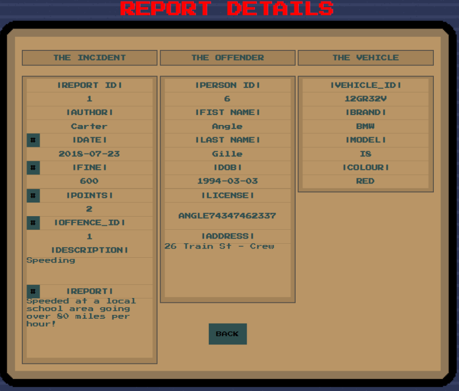

# Traffic-Police-Database

This is my coursework project for Database and Interface module in the University of Nottingham. Traffic Police is a website which has the capability to connect to a database and display and save data into its relations. 
The website is made to represents a Traffic Police database for offenders. You can log in here as a regular officer or an admin. 
You can look up an add new offenders, vehicles, and incidents in the database. 

# Tools
To create the website and the database I used:
-	HTML
-	CSS
-	JavaScript
-	PHP
-	MySQL
-	XAMPP Apache.

# Instructions
Detailed instructions on how to install the database and get the website running are in the psxrd2_UserManual.pdf file.
